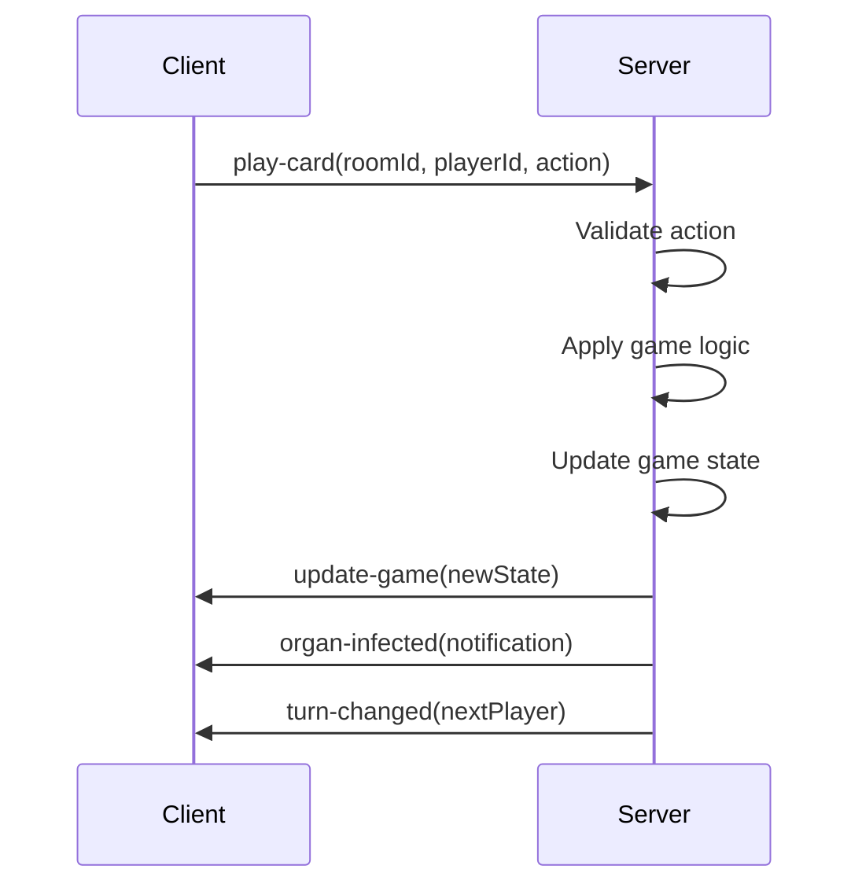

# 🏗️ Bacteria Online - Architecture Guide

## 🎯 Overview

Bacteria Online is a real-time multiplayer card game built with modern web technologies. This document provides a comprehensive technical overview of the system architecture, design patterns, and implementation details.

## 🏛️ System Architecture

### High-Level Architecture

```
┌─────────────────┐    ┌─────────────────┐
│   React Client  │◄──►│  Node.js Server │
│   (Frontend)    │    │   (Backend)     │
└─────────────────┘    └─────────────────┘
         │                        │
         │                        │
    ┌─────────┐              ┌─────────┐
    │ Browser │              │Socket.IO│
    │ Storage │              │ Engine  │
    └─────────┘              └─────────┘
```

### Technology Stack

#### Frontend

- **React 19**: UI library with modern hooks
- **TypeScript**: Type safety and better developer experience
- **Vite**: Fast development server and build tool
- **React Router**: Client-side routing
- **React Hot Toast**: Notification system
- **Socket.IO Client**: Real-time communication

#### Backend

- **Node.js**: Runtime environment
- **Express**: Web application framework
- **Socket.IO**: Real-time bidirectional communication
- **TypeScript**: Type safety on server side
- **CORS**: Cross-origin resource sharing

#### Development Tools

- **ESLint**: Code linting and formatting
- **TypeScript**: Static type checking
- **ts-node-dev**: Development server with hot reload

## 📁 Project Structure

### Root Directory

```
bacteria_online/
├── client/              # React frontend application
│   ├── src/
│   ├── public/
│   ├── package.json
│   └── vite.config.ts
├── server/              # Node.js backend
│   ├── src/
│   ├── package.json
│   └── tsconfig.json
├── docs/                # Documentation
├── README.md
├── GAME_RULES.md
└── ARCHITECTURE.md
```

### Client Architecture

```
client/src/
├── components/          # Reusable UI components
│   ├── Board/          # Game board visualization
│   ├── Card/           # Card display and interaction
│   ├── Game/           # Main game interface
│   ├── ConnectionIndicator/  # Network status
│   ├── ErrorBoundary/  # Error handling
│   └── PlayerList/     # Player management
├── pages/              # Main application pages
│   ├── Lobby/          # Home page and room creation
│   └── Room/           # Pre-game room interface
├── hooks/              # Custom React hooks
│   ├── game/           # Game state management
│   ├── lobby/          # Lobby functionality
│   └── room/           # Room management
├── interfaces/         # TypeScript type definitions
│   ├── game/           # Game-related interfaces
│   └── server/         # Server communication types
├── context/            # React Context providers
├── const/              # Application constants
├── utils/              # Utility functions
├── assets/             # Static assets
└── main.tsx           # Application entry point
```

### Server Architecture

```
server/src/
├── events/             # Socket.IO event handlers
│   ├── registerGameEvents.ts    # Game logic events
│   └── registerRoomEvents.ts    # Room management events
├── functions/          # Business logic
│   ├── gameLogic.ts    # Core game rules and mechanics
│   └── shuffle.ts      # Card shuffling utilities
├── types/              # TypeScript interfaces
│   └── interfaces.ts   # Shared type definitions
├── utils/              # Server utilities
│   └── logger.ts       # Logging functionality
├── const/              # Server constants
└── server.ts          # Main server application
```

## 🎮 Game State Management

### Client-Side State

#### Game State Hook (`useGame`)

```typescript
interface GameState {
  hand: Card[]; // Player's cards
  boards: { [playerId: string]: PlayerBoard }; // All player boards
  currentTurn: string; // Current player ID
  currentPhase: GamePhase; // Current game phase
  winner?: string; // Winner player ID
  canDraw: boolean; // Can draw cards
  canPlay: boolean; // Can play cards
  canEndTurn: boolean; // Can end turn
}
```

#### Player Board Structure

```typescript
interface PlayerBoard {
  organs: { [color: string]: OrganState };
}

interface OrganState {
  organ: Card; // The organ card
  bacteria: Card[]; // Bacteria on organ
  medicines: Card[]; // Medicines on organ
  status: OrganStatus; // Calculated status
}
```

### Server-Side State

#### Room Management

```typescript
interface Room {
  id: string; // Room identifier
  players: Player[]; // Connected players
  max_players: number; // Room capacity
  has_started: boolean; // Game status
  host: string; // Host player ID
  created_at: Date; // Creation timestamp
}

interface GameRoom extends Room {
  deck: Card[]; // Draw pile
  discardPile: Card[]; // Discard pile
  hands: { [playerId: string]: Card[] }; // Player hands
  boards: { [playerId: string]: PlayerBoard }; // Player boards
  currentTurn: string; // Current player
  currentPhase: GamePhase; // Current phase
  playerNames: { [playerId: string]: string }; // Player nicknames
}
```

## 🔌 Communication Architecture

### Socket.IO Events

#### Client to Server Events

```typescript
// Room Management
socket.emit("create-room", { nickname });
socket.emit("join-room", { roomId, nickname });
socket.emit("start-game", roomId);
socket.emit("leave-room", roomId);

// Game Actions
socket.emit("play-card", roomId, playerId, action);
socket.emit("discard-card", roomId, playerId, cardId);
socket.emit("draw-card", roomId, playerId);
socket.emit("end-turn", roomId, playerId);
```

#### Server to Client Events

```typescript
// Room Events
socket.emit("room-created", { roomId, playerId });
socket.emit("room-joined", { roomId, playerId });
socket.emit("player-joined", player);
socket.emit("player-left", playerId);
socket.emit("room-error", message);

// Game Events
socket.emit("game-started", gameState);
socket.emit("update-game", gameState);
socket.emit("game-ended", { winner, finalState });
socket.emit("turn-changed", { currentTurn, currentPhase });

// Notifications
socket.emit("organ-infected", { organColor, byPlayer });
socket.emit("organ-destroyed", { organColor, byPlayer });
socket.emit("card-played", { cardType, byPlayer });
```

### Event Flow Example



## 🎯 Core Game Logic

### Card Effect System

#### Card Types and Effects

```typescript
type CardType = "organ" | "bacteria" | "medicine" | "treatment";
type CardColor = "red" | "green" | "blue" | "yellow" | "rainbow";

interface Card {
  id: string; // Unique identifier
  type: CardType; // Card category
  color: CardColor; // Card color
}
```

#### Effect Processing Pipeline

```typescript
// 1. Validation
const canPlay = canPlayCard(card, playerBoard, targetBoard, targetOrgan);

// 2. Effect Application
const result = applyCardEffect(card, playerBoard, targetBoard, targetOrgan);

// 3. State Update
updateGameState(result);

// 4. Notification
notifyPlayers(result.changes);

// 5. Victory Check
const winner = checkWinCondition(allBoards);
```

### Treatment Card System

#### Treatment Types

```typescript
enum TreatmentType {
  TRANSPLANT = "transplant", // Exchange organs
  ORGAN_THIEF = "organ_thief", // Steal organ
  CONTAGION = "contagion", // Spread bacteria
  LATEX_GLOVE = "latex_glove", // Discard hands
  MEDICAL_ERROR = "medical_error", // Swap bodies
}
```

#### Treatment Processing

```typescript
function applyTreatmentEffect(
  card: Card,
  allBoards: PlayerBoardMap,
  currentPlayerId: string,
  action: PlayCardAction
): TreatmentResult {
  switch (card.color) {
    case "red":
      return applyTransplant(allBoards, currentPlayerId, action);
    case "green":
      return applyOrganThief(allBoards, currentPlayerId, action);
    case "blue":
      return applyContagion(allBoards, currentPlayerId);
    case "yellow":
      return applyLatexGlove(allBoards, currentPlayerId);
    case "rainbow":
      return applyMedicalError(allBoards, currentPlayerId, action);
  }
}
```

## 🎨 UI/UX Architecture

### Component Hierarchy

```
App
├── Router
│   ├── Lobby
│   │   ├── CreateRoom
│   │   └── JoinRoom
│   └── Room
│       ├── PlayerList
│       ├── GameControls
│       └── Game
│           ├── BoardContainer
│           │   └── Board (multiple)
│           ├── HandContainer
│           │   └── Card (multiple)
│           └── ActionButtons
└── Providers
    ├── AppContext
    ├── NotificationProvider
    └── ErrorBoundary
```

### State Management Pattern

```typescript
// Custom hooks for separation of concerns
const gameState = useGame({ roomId, isGameStarted });
const socketState = useSocketConnection();
const notifications = useGameNotifications();
const playerId = usePlayerId();

// Context for shared state
const { socket, isConnected } = useAppContext();
```

### Responsive Design Strategy

```css
/* Mobile-first approach */
.game-container {
  /* Base mobile styles */
}

@media (min-width: 768px) {
  .game-container {
    /* Tablet styles */
  }
}

@media (min-width: 1024px) {
  .game-container {
    /* Desktop styles */
  }
}
```

## 🔒 Security Considerations

### Input Validation

```typescript
// Client-side validation
const validateRoomCode = (code: string): boolean => {
  return /^[A-Z0-9]{6}$/.test(code);
};

// Server-side validation
const validatePlayAction = (action: PlayCardAction): boolean => {
  return action.cardId && action.targetPlayerId && action.targetOrganColor;
};
```

### Player Authentication

```typescript
// Generate unique player ID
const generatePlayerId = (): string => {
  return crypto.randomUUID();
};

// Validate player actions
const validatePlayerAction = (roomId: string, playerId: string): boolean => {
  const room = rooms[roomId];
  return room?.players.some((p) => p.playerId === playerId);
};
```

### Room Security

```typescript
// Room code generation
const generateRoomCode = (): string => {
  const chars = "ABCDEFGHIJKLMNOPQRSTUVWXYZ0123456789";
  return Array.from(
    { length: 6 },
    () => chars[Math.floor(Math.random() * chars.length)]
  ).join("");
};

// Room capacity limits
const MAX_PLAYERS = 6;
const MAX_ROOMS = 1000;
```

## 📊 Performance Optimization

### Client-Side Optimizations

#### React Performance

```typescript
// Memoization for expensive calculations
const memoizedBoardState = useMemo(() => {
  return calculateBoardState(boards);
}, [boards]);

// Callback memoization
const handleCardClick = useCallback(
  (cardId: string) => {
    // Handle card selection
  },
  [selectedCards]
);

// Component memoization
const MemoizedBoard = React.memo(Board);
```

#### Bundle Optimization

```typescript
// Vite configuration
export default defineConfig({
  plugins: [react()],
  build: {
    rollupOptions: {
      output: {
        manualChunks: {
          vendor: ["react", "react-dom"],
          socket: ["socket.io-client"],
        },
      },
    },
  },
});
```

### Server-Side Optimizations

#### Memory Management

```typescript
// Room cleanup
const cleanupRoom = (roomId: string): void => {
  delete rooms[roomId];
  console.log(`Room ${roomId} cleaned up`);
};

// Automatic cleanup
setInterval(() => {
  Object.entries(rooms).forEach(([roomId, room]) => {
    if (room.players.length === 0) {
      cleanupRoom(roomId);
    }
  });
}, 30000); // Every 30 seconds
```

#### Connection Optimization

```typescript
// Socket.IO configuration
const io = new Server(server, {
  pingTimeout: 60000,
  pingInterval: 25000,
  cors: {
    origin: process.env.CLIENT_URL || "*",
  },
});
```

## 🧪 Testing Strategy

### Unit Testing

```typescript
// Game logic testing
describe("gameLogic", () => {
  test("should calculate organ status correctly", () => {
    const organState = createOrganState();
    const status = calculateOrganStatus(organState);
    expect(status).toBe("healthy");
  });
});

// Component testing
describe("Board", () => {
  test("should render organs correctly", () => {
    render(<Board board={mockBoard} />);
    expect(screen.getByText("Heart")).toBeInTheDocument();
  });
});
```

### Integration Testing

```typescript
// Socket event testing
describe("Socket Events", () => {
  test("should handle room creation", (done) => {
    socket.emit("create-room", { nickname: "Test" });
    socket.on("room-created", (data) => {
      expect(data.roomId).toBeDefined();
      done();
    });
  });
});
```

### End-to-End Testing

```typescript
// Playwright testing
test("complete game flow", async ({ page }) => {
  await page.goto("/");
  await page.click('[data-testid="create-room"]');
  await page.fill('[data-testid="nickname"]', "Player1");
  await page.click('[data-testid="start-game"]');

  // Assert game started
  await expect(page.locator('[data-testid="game-board"]')).toBeVisible();
});
```

## 🚀 Deployment Architecture

### Production Environment

```yaml
# docker-compose.yml
version: "3.8"
services:
  client:
    build: ./client
    ports:
      - "80:80"
    depends_on:
      - server

  server:
    build: ./server
    ports:
      - "3000:3000"
    environment:
      - NODE_ENV=production
      - PORT=3000
```

### CI/CD Pipeline

```yaml
# .github/workflows/deploy.yml
name: Deploy
on:
  push:
    branches: [main]
jobs:
  deploy:
    runs-on: ubuntu-latest
    steps:
      - uses: actions/checkout@v2
      - name: Setup Node.js
        uses: actions/setup-node@v2
        with:
          node-version: "18"
      - name: Install dependencies
        run: npm ci
      - name: Run tests
        run: npm test
      - name: Build application
        run: npm run build
      - name: Deploy to production
        run: npm run deploy
```

## 📈 Monitoring and Logging

### Server Monitoring

```typescript
// Performance monitoring
const startTime = Date.now();
const processTime = Date.now() - startTime;
console.log(`Game action processed in ${processTime}ms`);

// Error tracking
process.on("unhandledRejection", (reason, promise) => {
  console.error("Unhandled Rejection at:", promise, "reason:", reason);
});
```

### Client Monitoring

```typescript
// Performance tracking
const observer = new PerformanceObserver((list) => {
  list.getEntries().forEach((entry) => {
    console.log(`${entry.name}: ${entry.duration}ms`);
  });
});
observer.observe({ entryTypes: ["measure"] });

// Error boundary logging
class ErrorBoundary extends Component {
  componentDidCatch(error: Error, errorInfo: ErrorInfo) {
    console.error("React Error:", error, errorInfo);
  }
}
```

## 🔮 Future Architecture Considerations

### Scalability

- **Horizontal scaling**: Multiple server instances
- **Load balancing**: Distribute connections
- **Database integration**: Persistent game state
- **Caching**: Redis for session management

### Advanced Features

- **AI integration**: Computer opponents
- **Analytics**: Game statistics and insights
- **Internationalization**: Multi-language support
- **Progressive Web App**: Offline capabilities

### Technical Debt

- **Code splitting**: Lazy loading components
- **State management**: Consider Redux for complex state
- **Testing coverage**: Increase test coverage to 90%+
- **Documentation**: API documentation with OpenAPI

---

This architecture guide provides a comprehensive overview of the Bacteria Online system design. For specific implementation details, refer to the source code and inline documentation.
